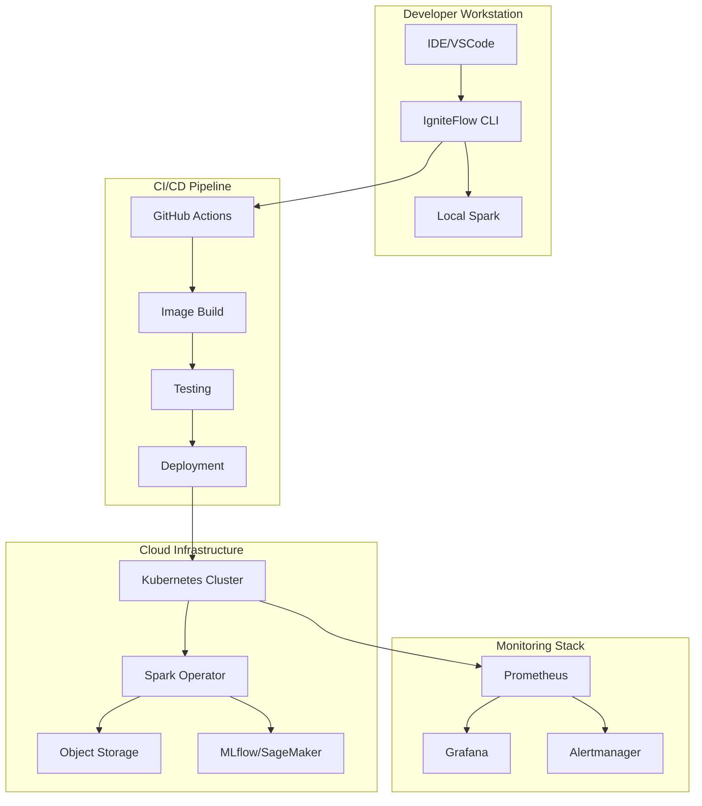
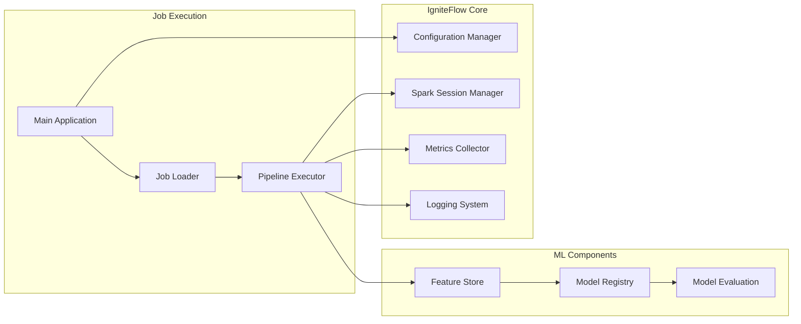

# 🚀 IgniteFlow: Cloud-Native Spark ETL & ML Framework

<div align="center">

[](https://python.org)
[](https://spark.apache.org)
[](https://kubernetes.io)
[](https://opensource.org/licenses/MIT)
[](https://mlops.org)

**Production-ready template for cloud-native Spark ETL & Machine Learning pipelines**  
*Container-first • Infrastructure-as-Code • SOLID Principles • MLOps Integration*

</div>

---

## 📋 Table of Contents

- [🎯 Why IgniteFlow?](#-why-igniteflow)
- [✨ Key Features](#-key-features)
- [🏗️ Architecture Overview](#️-architecture-overview)
- [📁 Project Structure](#-project-structure)
- [🚀 Quick Start](#-quick-start)
- [💻 Local Development](#-local-development)
- [☁️ Cloud Deployment](#️-cloud-deployment)
- [🤖 MLOps Integration](#-mlops-integration)
- [📊 Example Pipelines](#-example-pipelines)
- [⚙️ Configuration](#️-configuration)
- [📈 Observability](#-observability)
- [🔧 Advanced Usage](#-advanced-usage)
- [🤝 Contributing](#-contributing)

---

## 🎯 Why IgniteFlow?

IgniteFlow has been **re-engineered from the ground up** for modern data engineering and MLOps needs. Born from enterprise experience but designed for cloud-native simplicity.

### 🎪 Use Cases We Excel At

- **🔄 ETL Pipelines** — Scalable batch/streaming data transformation
- **🤖 ML Workflows** — End-to-end model training, validation, and deployment  
- **📊 Real-time Analytics** — Stream processing with Kafka integration
- **🚨 Fraud Detection** — Real-time anomaly detection and scoring
- **💡 Recommendation Systems** — Collaborative filtering and content-based recommendations
- **📱 Feature Engineering** — Automated feature stores with versioning

### 🏛️ Architectural Principles

> *"Focus on what you control (clean code, reproducible infra); accept what you don't (cloud outages, market shifts)"*

- **SOLID Design** — Maintainable, testable, extensible code
- **Cloud Native** — Kubernetes-first with multi-cloud support
- **Configuration as Code** — Environment-specific configs without code changes
- **Observability First** — Comprehensive metrics, logging, and tracing

## ✨ Key Features

<table>
<tr>
<td width="33%">

### 🏗️ **Modern Architecture**
- SOLID principles & clean code
- Type-safe Python 3.12+
- Comprehensive error handling
- Modular, testable design

</td>
<td width="33%">

### ☁️ **Cloud Native**
- Kubernetes-native execution
- Multi-cloud support (AWS/Azure/GCP)
- Auto-scaling & resource optimization
- Infrastructure as Code (Terraform)

</td>
<td width="33%">

### 🤖 **MLOps Ready**
- MLflow integration
- SageMaker support
- Model versioning & registry
- A/B testing capabilities

</td>
</tr>
<tr>
<td>

### 📊 **Data Engineering**
- Spark 3.5+ with Delta Lake
- Real-time streaming (Kafka)
- Data quality validation
- Schema evolution support

</td>
<td>

### 🔧 **Developer Experience**
- One-command local setup
- Hot-reload development
- Comprehensive testing
- Rich CLI interface

</td>
<td>

### 📈 **Production Ready**
- Prometheus metrics
- Structured logging
- OpenTelemetry tracing
- Circuit breakers & retries

</td>
</tr>
</table>

## 🏗️ Architecture Overview

### High-Level Architecture



### Component Architecture



## 📁 Project Structure

```
📁 IgniteFlow/
├── 📁 src/                           # Source code
│   ├── 📁 bin/                       # Application entry points
│   │   ├── main.py                   # Main application
│   │   └── 📁 pipelines/             # Pipeline implementations
│   ├── 📁 igniteflow_core/           # Core framework
│   │   ├── config.py                 # Configuration management
│   │   ├── spark.py                  # Spark session management
│   │   ├── logging.py                # Logging utilities
│   │   ├── metrics.py                # Metrics collection
│   │   └── exceptions.py             # Custom exceptions
│   ├── 📁 config/                    # Configuration files
│   │   ├── spark_config.json         # Spark configurations
│   │   ├── parameters.json           # Job parameters
│   │   └── 📁 environments/          # Environment-specific configs
│   ├── 📁 examples/                  # Example pipelines
│   │   ├── fraud_detection/          # Fraud detection pipeline
│   │   └── recommendation_system/    # Recommendation engine
│   └── 📁 tests/                     # Test suites
├── 📁 terraform/                     # Infrastructure as Code
│   ├── 📁 modules/                   # Reusable modules
│   └── 📁 environments/              # Environment definitions
├── 📁 helm/                          # Kubernetes deployment
│   ├── charts/                       # Helm charts
│   └── values/                       # Environment values
├── 📁 .github/workflows/             # CI/CD pipelines
├── 📁 docs/                          # Documentation
│   ├── architecture.md               # Architecture details
│   └── examples/                     # Usage examples
└── 📄 README.md                      # This file
```

## 🚀 Quick Start

### Prerequisites

- **Docker** 20.10+ with 8GB+ RAM allocated
- **Python** 3.12+ 
- **Git** 2.30+
- **kubectl** (for Kubernetes deployment)

### 1. Clone and Setup

```bash
# Clone the repository
git clone https://github.com/your-org/igniteflow.git
cd igniteflow

# Create virtual environment
python -m venv venv
source venv/bin/activate  # Windows: venv\Scripts\activate

# Install dependencies
pip install -r requirements.txt
```

### 2. Local Development Setup

```bash
# Set up environment
source src/opt/profile.sh

# Run a simple example
./src/opt/spark_exe.sh --job wordcount --env local

# Start JupyterLab for development
jupyter lab --ip=0.0.0.0 --port=8888 --no-browser
```

### 3. Run Example Pipelines

```bash
# Fraud detection pipeline
./src/opt/spark_exe.sh --job fraud_detection --env local

# Recommendation system
./src/opt/spark_exe.sh --job recommendation_system --env local

# Custom pipeline with configuration
./src/opt/spark_exe.sh --job my_pipeline --env dev --config config/custom.json
```

## 💻 Local Development

### Development Environment

```bash
# Start local Spark cluster
docker-compose up -d spark-master spark-worker

# Access Spark UI
open http://localhost:8080

# Access Jupyter Lab
open http://localhost:8888
```

### Code Quality Tools

```bash
# Format code
black src/
isort src/

# Lint code
flake8 src/
mypy src/

# Run tests
pytest src/tests/ -v

# Run with coverage
pytest --cov=src --cov-report=html
```

### Hot Reload Development

```bash
# Watch for changes and auto-restart
watchdog src/ --patterns="*.py" --command="python src/bin/main.py --job test_job --env local"
```

## ☁️ Cloud Deployment

### AWS Deployment

```bash
# Deploy infrastructure
cd terraform/environments/aws-dev
terraform init
terraform apply

# Deploy application
helm upgrade --install igniteflow ./helm/igniteflow \
  --values helm/values/aws-dev.yaml \
  --namespace igniteflow
```

### Azure Deployment

```bash
# Deploy infrastructure
cd terraform/environments/azure-dev
terraform init
terraform apply

# Deploy application
helm upgrade --install igniteflow ./helm/igniteflow \
  --values helm/values/azure-dev.yaml \
  --namespace igniteflow
```

### Kubernetes Job Submission

```bash
# Submit via kubectl
kubectl apply -f - <<EOF
apiVersion: sparkoperator.k8s.io/v1beta2
kind: SparkApplication
metadata:
  name: fraud-detection-job
  namespace: igniteflow
spec:
  type: Python
  pythonVersion: "3.12"
  mode: cluster
  image: "igniteflow/spark:latest"
  imagePullPolicy: Always
  mainApplicationFile: local:///app/src/bin/main.py
  arguments:
    - "--job"
    - "fraud_detection"
    - "--environment"
    - "production"
EOF
```

## 🤖 MLOps Integration

### MLflow Integration

IgniteFlow includes comprehensive MLflow integration for experiment tracking, model registry, and deployment.

```python
# src/examples/mlops/mlflow_example.py
from igniteflow_core.mlops import MLflowTracker
from igniteflow_core.spark import SparkSessionManager

class FraudDetectionPipeline:
    def __init__(self, spark, config):
        self.spark = spark
        self.config = config
        self.mlflow = MLflowTracker(config.mlflow)
    
    def run(self):
        with self.mlflow.start_run("fraud_detection_training"):
            # Load and prepare data
            data = self.load_data()
            
            # Feature engineering
            features = self.engineer_features(data)
            
            # Train model
            model = self.train_model(features)
            
            # Log metrics and model
            self.mlflow.log_metrics(model.metrics)
            self.mlflow.log_model(model, "fraud_detection_model")
            
            return model
```

### SageMaker Integration

```python
# src/examples/mlops/sagemaker_example.py
from igniteflow_core.mlops import SageMakerIntegration

class ModelDeployment:
    def __init__(self, config):
        self.sagemaker = SageMakerIntegration(config.sagemaker)
    
    def deploy_model(self, model_uri):
        # Deploy model to SageMaker endpoint
        endpoint = self.sagemaker.deploy_model(
            model_uri=model_uri,
            instance_type="ml.m5.large",
            endpoint_name="fraud-detection-endpoint"
        )
        
        return endpoint
```

## 📊 Example Pipelines

### Fraud Detection Pipeline

Real-time fraud detection using advanced ML techniques:

```python
# src/examples/fraud_detection/pipeline.py
"""
Real-time Fraud Detection Pipeline

Features:
- Real-time transaction scoring
- Feature engineering with sliding windows
- Model ensemble with XGBoost and Neural Networks
- Integration with MLflow for model tracking
"""

from typing import Dict, Any
import logging
from pyspark.sql import DataFrame
from pyspark.ml import Pipeline
from pyspark.ml.feature import VectorAssembler, StandardScaler
from pyspark.ml.classification import GBTClassifier

from igniteflow_core.base import BasePipeline
from igniteflow_core.mlops import MLflowTracker
from igniteflow_core.data_quality import DataQualityValidator


class FraudDetectionPipeline(BasePipeline):
    """
    Production-ready fraud detection pipeline with MLOps integration.
    
    This pipeline implements:
    - Feature engineering with time-based aggregations
    - Model training with cross-validation
    - Real-time scoring capabilities
    - Data quality validation
    - MLflow experiment tracking
    """
    
    def __init__(self, spark, config):
        super().__init__(spark, config)
        self.logger = logging.getLogger(__name__)
        self.mlflow = MLflowTracker(config.mlflow)
        self.validator = DataQualityValidator(config.data_quality)
    
    def extract_data(self) -> DataFrame:
        """Extract transaction data from multiple sources."""
        # Load transaction data
        transactions = self.spark.read.parquet(
            self.config.get("data.transactions.path")
        )
        
        # Load customer profiles
        customers = self.spark.read.parquet(
            self.config.get("data.customers.path")
        )
        
        # Join and validate data quality
        data = transactions.join(customers, "customer_id", "left")
        self.validator.validate_schema(data, "fraud_detection_schema")
        
        return data
    
    def engineer_features(self, data: DataFrame) -> DataFrame:
        """Engineer fraud detection features."""
        from pyspark.sql import functions as F
        from pyspark.sql.window import Window
        
        # Time-based aggregations
        window_7d = Window.partitionBy("customer_id").orderBy("timestamp") \
                          .rowsBetween(-7*24*60, 0)  # 7 days
        
        window_1h = Window.partitionBy("customer_id").orderBy("timestamp") \
                          .rowsBetween(-60, 0)  # 1 hour
        
        features = data.withColumn(
            "tx_amount_7d_avg", F.avg("amount").over(window_7d)
        ).withColumn(
            "tx_count_1h", F.count("transaction_id").over(window_1h)
        ).withColumn(
            "tx_amount_zscore", 
            (F.col("amount") - F.col("tx_amount_7d_avg")) / 
            F.stddev("amount").over(window_7d)
        )
        
        # Categorical feature encoding
        features = self.encode_categorical_features(features)
        
        return features
    
    def train_model(self, features: DataFrame) -> Any:
        """Train fraud detection model with MLflow tracking."""
        with self.mlflow.start_run("fraud_detection_training"):
            # Feature vector assembly
            assembler = VectorAssembler(
                inputCols=self.config.get("model.feature_columns"),
                outputCol="features"
            )
            
            # Feature scaling
            scaler = StandardScaler(
                inputCol="features",
                outputCol="scaled_features"
            )
            
            # Model training
            gbt = GBTClassifier(
                featuresCol="scaled_features",
                labelCol="is_fraud",
                maxIter=100,
                maxDepth=5
            )
            
            # Create ML pipeline
            ml_pipeline = Pipeline(stages=[assembler, scaler, gbt])
            
            # Split data
            train_data, test_data = features.randomSplit([0.8, 0.2], seed=42)
            
            # Train model
            model = ml_pipeline.fit(train_data)
            
            # Evaluate model
            predictions = model.transform(test_data)
            metrics = self.evaluate_model(predictions)
            
            # Log to MLflow
            self.mlflow.log_metrics(metrics)
            self.mlflow.log_model(model, "fraud_detection_model")
            
            return model
    
    def evaluate_model(self, predictions: DataFrame) -> Dict[str, float]:
        """Evaluate model performance."""
        from pyspark.ml.evaluation import BinaryClassificationEvaluator
        
        evaluator = BinaryClassificationEvaluator(
            labelCol="is_fraud",
            rawPredictionCol="rawPrediction"
        )
        
        auc = evaluator.evaluate(predictions)
        
        # Calculate additional metrics
        tp = predictions.filter((F.col("is_fraud") == 1) & (F.col("prediction") == 1)).count()
        fp = predictions.filter((F.col("is_fraud") == 0) & (F.col("prediction") == 1)).count()
        tn = predictions.filter((F.col("is_fraud") == 0) & (F.col("prediction") == 0)).count()
        fn = predictions.filter((F.col("is_fraud") == 1) & (F.col("prediction") == 0)).count()
        
        precision = tp / (tp + fp) if (tp + fp) > 0 else 0
        recall = tp / (tp + fn) if (tp + fn) > 0 else 0
        f1 = 2 * (precision * recall) / (precision + recall) if (precision + recall) > 0 else 0
        
        return {
            "auc": auc,
            "precision": precision,
            "recall": recall,
            "f1_score": f1
        }
    
    def run(self) -> Dict[str, Any]:
        """Execute the complete fraud detection pipeline."""
        self.logger.info("Starting fraud detection pipeline")
        
        try:
            # Extract data
            data = self.extract_data()
            self.logger.info(f"Extracted {data.count()} transactions")
            
            # Engineer features
            features = self.engineer_features(data)
            self.logger.info("Feature engineering completed")
            
            # Train model
            model = self.train_model(features)
            self.logger.info("Model training completed")
            
            # Save model for production use
            model_path = self.config.get("model.output_path")
            model.write().overwrite().save(model_path)
            
            return {
                "status": "success",
                "model_path": model_path,
                "record_count": data.count()
            }
            
        except Exception as e:
            self.logger.error(f"Pipeline failed: {str(e)}", exc_info=True)
            raise


def create_job(spark, config):
    """Factory function to create the fraud detection job."""
    return FraudDetectionPipeline(spark, config)
```

### Recommendation System Pipeline

Collaborative filtering recommendation system:

```python
# src/examples/recommendation_system/pipeline.py
"""
Recommendation System Pipeline

Features:
- Collaborative filtering with ALS
- Content-based recommendations
- Real-time inference API
- A/B testing capabilities
"""

from typing import Dict, Any, List
import logging
from pyspark.sql import DataFrame
from pyspark.ml.recommendation import ALS
from pyspark.ml.evaluation import RegressionEvaluator

from igniteflow_core.base import BasePipeline
from igniteflow_core.mlops import MLflowTracker


class RecommendationPipeline(BasePipeline):
    """
    Production recommendation system using collaborative filtering.
    
    Implements:
    - Matrix factorization with ALS
    - Cold start handling
    - Real-time serving infrastructure
    - A/B testing framework
    """
    
    def __init__(self, spark, config):
        super().__init__(spark, config)
        self.logger = logging.getLogger(__name__)
        self.mlflow = MLflowTracker(config.mlflow)
    
    def extract_data(self) -> DataFrame:
        """Extract user-item interaction data."""
        # Load user ratings
        ratings = self.spark.read.parquet(
            self.config.get("data.ratings.path")
        )
        
        # Load item metadata
        items = self.spark.read.parquet(
            self.config.get("data.items.path")
        )
        
        return ratings, items
    
    def prepare_training_data(self, ratings: DataFrame) -> DataFrame:
        """Prepare data for collaborative filtering."""
        from pyspark.sql import functions as F
        
        # Filter out users/items with too few interactions
        min_interactions = self.config.get("model.min_interactions", 5)
        
        user_counts = ratings.groupBy("user_id").count()
        item_counts = ratings.groupBy("item_id").count()
        
        valid_users = user_counts.filter(F.col("count") >= min_interactions)
        valid_items = item_counts.filter(F.col("count") >= min_interactions)
        
        filtered_ratings = ratings \
            .join(valid_users.select("user_id"), "user_id") \
            .join(valid_items.select("item_id"), "item_id")
        
        return filtered_ratings
    
    def train_als_model(self, ratings: DataFrame) -> Any:
        """Train ALS collaborative filtering model."""
        with self.mlflow.start_run("recommendation_training"):
            # Configure ALS
            als = ALS(
                maxIter=self.config.get("model.als.max_iter", 20),
                regParam=self.config.get("model.als.reg_param", 0.1),
                rank=self.config.get("model.als.rank", 50),
                userCol="user_id",
                itemCol="item_id",
                ratingCol="rating",
                coldStartStrategy="drop"
            )
            
            # Split data
            train_data, test_data = ratings.randomSplit([0.8, 0.2], seed=42)
            
            # Train model
            model = als.fit(train_data)
            
            # Evaluate model
            predictions = model.transform(test_data)
            evaluator = RegressionEvaluator(
                metricName="rmse",
                labelCol="rating",
                predictionCol="prediction"
            )
            rmse = evaluator.evaluate(predictions)
            
            # Log metrics
            self.mlflow.log_metric("rmse", rmse)
            self.mlflow.log_model(model, "recommendation_model")
            
            self.logger.info(f"Model trained with RMSE: {rmse}")
            
            return model
    
    def generate_recommendations(self, model: Any, num_recommendations: int = 10) -> DataFrame:
        """Generate top-N recommendations for all users."""
        # Generate recommendations for all users
        user_recs = model.recommendForAllUsers(num_recommendations)
        
        # Flatten recommendations
        from pyspark.sql import functions as F
        
        recommendations = user_recs.select(
            F.col("user_id"),
            F.explode("recommendations").alias("recommendation")
        ).select(
            "user_id",
            F.col("recommendation.item_id"),
            F.col("recommendation.rating").alias("score")
        )
        
        return recommendations
    
    def run(self) -> Dict[str, Any]:
        """Execute the recommendation pipeline."""
        self.logger.info("Starting recommendation system pipeline")
        
        try:
            # Extract data
            ratings, items = self.extract_data()
            self.logger.info(f"Loaded {ratings.count()} ratings")
            
            # Prepare training data
            training_data = self.prepare_training_data(ratings)
            self.logger.info(f"Prepared {training_data.count()} training samples")
            
            # Train model
            model = self.train_als_model(training_data)
            
            # Generate recommendations
            recommendations = self.generate_recommendations(model)
            
            # Save recommendations
            output_path = self.config.get("model.recommendations_output_path")
            recommendations.write.mode("overwrite").parquet(output_path)
            
            # Save model
            model_path = self.config.get("model.output_path")
            model.write().overwrite().save(model_path)
            
            return {
                "status": "success",
                "model_path": model_path,
                "recommendations_path": output_path,
                "user_count": training_data.select("user_id").distinct().count(),
                "item_count": training_data.select("item_id").distinct().count()
            }
            
        except Exception as e:
            self.logger.error(f"Pipeline failed: {str(e)}", exc_info=True)
            raise


def create_job(spark, config):
    """Factory function to create the recommendation job."""
    return RecommendationPipeline(spark, config)
```

## ⚙️ Configuration

### Environment-Specific Configuration

```json
{
  "spark_config": {
    "app_name": "IgniteFlow-{job_name}",
    "master": "local[*]",
    "driver_memory": "2g",
    "executor_memory": "2g",
    "sql": {
      "adaptive": {
        "enabled": true,
        "coalescePartitions": {
          "enabled": true
        }
      }
    }
  },
  "mlflow": {
    "tracking_uri": "http://mlflow:5000",
    "experiment_name": "igniteflow_experiments",
    "registry_uri": "s3://mlflow-artifacts"
  },
  "data_quality": {
    "enabled": true,
    "rules": [
      {
        "name": "null_check",
        "type": "completeness",
        "columns": ["user_id", "item_id"],
        "threshold": 0.95
      }
    ]
  }
}
```

### Job-Specific Parameters

```json
{
  "fraud_detection": {
    "data": {
      "transactions": {
        "path": "s3a://data-lake/transactions/",
        "format": "parquet"
      },
      "customers": {
        "path": "s3a://data-lake/customers/",
        "format": "parquet"
      }
    },
    "model": {
      "feature_columns": [
        "amount", "merchant_category", "hour_of_day",
        "tx_amount_7d_avg", "tx_count_1h", "tx_amount_zscore"
      ],
      "output_path": "s3a://model-registry/fraud-detection/",
      "min_interactions": 5
    }
  }
}
```

## 📈 Observability

### Metrics Collection

IgniteFlow automatically collects comprehensive metrics:

```python
# Automatically tracked metrics
- job.{job_name}.duration
- job.{job_name}.success
- job.{job_name}.failure
- spark.executors.active
- data.records.processed
- model.training.accuracy
```

### Custom Metrics

```python
from igniteflow_core.metrics import MetricsCollector

metrics = MetricsCollector()

# Custom business metrics
metrics.gauge("fraud_detection.high_risk_transactions", high_risk_count)
metrics.histogram("recommendation.response_time", response_time)
metrics.increment("api.requests.total", tags={"endpoint": "/predict"})
```

### Grafana Dashboard

Pre-built dashboards for monitoring:

- **Job Execution Metrics** — Success rates, duration, error rates
- **Spark Cluster Health** — Executor status, memory usage, task failures
- **Data Quality Metrics** — Schema validation, data freshness, completeness
- **ML Model Performance** — Accuracy, drift detection, prediction latency

## 🔧 Advanced Usage

### Custom Data Sources

```python
# src/igniteflow_core/data_sources.py
from abc import ABC, abstractmethod

class DataSource(ABC):
    @abstractmethod
    def read(self, spark, config) -> DataFrame:
        pass

class S3DataSource(DataSource):
    def read(self, spark, config) -> DataFrame:
        return spark.read.parquet(config.path)

class KafkaDataSource(DataSource):
    def read(self, spark, config) -> DataFrame:
        return spark.readStream.format("kafka") \
            .option("kafka.bootstrap.servers", config.brokers) \
            .option("subscribe", config.topics) \
            .load()
```

### Custom Transformations

```python
# src/transformations/custom_transformers.py
from pyspark.ml import Transformer
from pyspark.sql import DataFrame

class CustomFeatureTransformer(Transformer):
    def _transform(self, dataset: DataFrame) -> DataFrame:
        # Your custom transformation logic
        return dataset.withColumn("custom_feature", F.col("amount") * 1.1)
```

### Plugin Architecture

```python
# src/plugins/custom_plugin.py
from igniteflow_core.plugins import BasePlugin

class CustomMLOpsPlugin(BasePlugin):
    def before_job(self, context):
        # Setup custom MLOps tracking
        pass
    
    def after_job(self, context, result):
        # Custom post-processing
        pass
```

## 🤝 Contributing

We welcome contributions! Please read our [Contributing Guide](CONTRIBUTING.md) for details on:

- 🐛 **Bug Reports** — Use GitHub issues with bug template
- ✨ **Feature Requests** — Propose new features via discussions
- 🔀 **Pull Requests** — Follow our PR template and guidelines
- 📚 **Documentation** — Help improve our docs

### Development Setup

```bash
# Clone repository
git clone https://github.com/your-org/igniteflow.git
cd igniteflow

# Install development dependencies
pip install -r requirements-dev.txt

# Install pre-commit hooks
pre-commit install

# Run tests
pytest -xvs
```

### Code Quality Standards

- **Type Hints** — All functions must have type annotations
- **Documentation** — Comprehensive docstrings following PEP 257
- **Testing** — Minimum 80% code coverage
- **SOLID Principles** — Clean, maintainable, testable code

---

<div align="center">

### 🚀 Ready to build production-grade data pipelines?

**[Get Started](#-quick-start)** • **[View Examples](#-example-pipelines)** • **[Join Community](https://github.com/your-org/igniteflow/discussions)**

*Built with ❤️ by the IgniteFlow team*

</div>